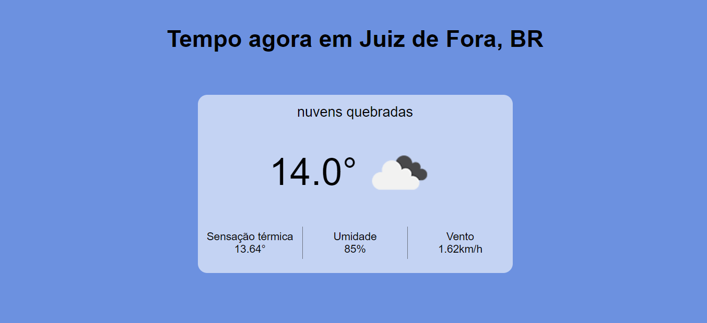
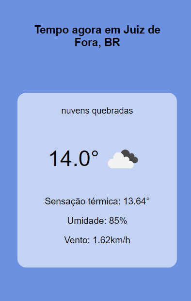

# Previsão do tempo

Acesse o projeto <a href="https://jonathanrianelli.github.io/previsao-do-tempo/">aqui</a>

## Descrição

Ferramenta de previsão do tempo, utilizando a API OpenWeatherMap

## Tecnologias Usadas
- ✔️ HTML
- ✔️ CSS
- ✔️ JavaScript
- ✔️ React

## Layout 
### Desktop:

### Mobile:
